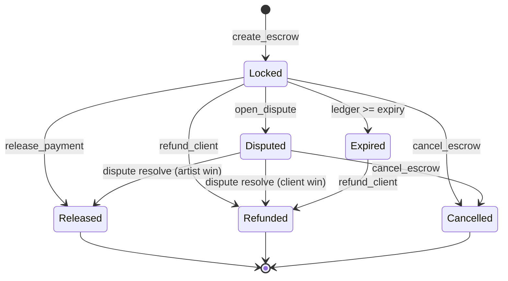

# [ADR-0002] Escrow Contract State Machine and CEI Pattern

* **Status:** Accepted
* **Date:** 2026-02-01
* **Authors:** StellarAid Core Team
* **Deciders:** Security Auditors & Smart Contract Developers
* **Component:** Escrow (`contracts/escrow`)

---

## Context and Problem Statement

The Escrow contract holds locked USDC/token funds between clients and service providers/artists. It must prevent double-spending, unauthorized drain, re-entrancy attacks, and race conditions between release, refund, dispute, and cancellation flows.

## Decision Drivers

* Strict Checks-Effects-Interactions (CEI) security guarantee.
* Robust state machine transitions with terminal status invariants.
* Support for fee calculation and automatic platform fee deduction.
* Re-entrancy protection across cross-contract calls.

## State Machine Diagram

## Considered Options

1. **Option 1: Checks-Effects-Interactions (CEI) + Mutex Re-entrancy Guard** — Mutate state storage *before* invoking external token transfer contracts, with temporary storage locks.
2. **Option 2: Interactions-First with Rollback on Revert** — Attempt token transfers and update state post-transfer.
3. **Option 3: External Escrow Hub Pattern** — Centralized router managing all escrows in a shared map.

## Decision Outcome

**Chosen Option:** **Option 1 (CEI + Re-entrancy Guard)**.

In every payment lifecycle function (`create_escrow`, `release_payment`, `refund_client`, `cancel_escrow`), the contract:
1. Validates preconditions and caller authentication (`require_auth()`).
2. Mutates internal status to terminal/intermediate state in persistent storage.
3. Performs token transfer via cross-contract call (`token::Client`).
4. Clears re-entrancy lock and emits events.

### Positive Consequences

* Immune to re-entrant draining attacks during cross-contract token transfers.
* Escrows are isolated by unique `commission_id: Bytes` keys.
* Deterministic error codes (`EscrowError::InvalidStatus`, `EscrowError::Reentrant`).

---

## Implementation & Code References

* Contract: `contracts/escrow/src/lib.rs`
* Storage: `contracts/escrow/src/storage.rs` (`EscrowRecord`, `CommissionStatus`)
* Error Enum: `contracts/escrow/src/errors.rs` (`EscrowError`)
* Safety tests: `contracts/escrow/src/tests.rs` (`test_cei_*`)
