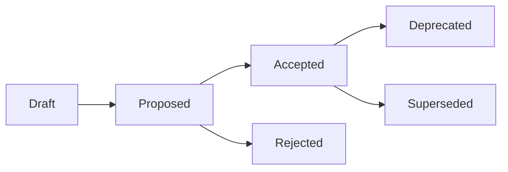

# Architecture Decision Records (ADRs)

This directory contains Architecture Decision Records (ADRs) for the **StellarAid Smart Contracts & SDK Ecosystem**.

An Architecture Decision Record captures an important architectural decision made along with its context, considered options, rationales, and consequences.

---

## ADR Status Lifecycle

* **Draft:** Decision is being formulated and drafted.
* **Proposed:** Submitted for review and stakeholder discussion.
* **Accepted:** Decision has been approved and implemented in code.
* **Rejected:** Proposal was considered but not adopted.
* **Deprecated:** Previously accepted decision is no longer recommended.
* **Superseded:** Replaced by a subsequent ADR (linked).

---

## Decision Timeline & Register

| ADR ID | Title | Status | Date | Component |
|--------|-------|--------|------|-----------|
| [ADR-0000](0000-template.md) | Standard Architecture Decision Record Template | Accepted | 2026-01-15 | All |
| [ADR-0001](0001-soroban-smart-contract-platform.md) | Adoption of Stellar Soroban Rust Smart Contract Platform | Accepted | 2026-01-20 | Core / Platform |
| [ADR-0002](0002-escrow-architecture-and-state-machine.md) | Escrow Contract State Machine and CEI Pattern | Accepted | 2026-02-01 | Escrow |
| [ADR-0003](0003-commission-agreement-milestone-flow.md) | Multi-Milestone Commission Agreements and Concurrency Locks | Accepted | 2026-02-15 | Commission Agreement |
| [ADR-0004](0004-dispute-resolution-and-arbitration.md) | Autonomous Dispute Arbiter & Cross-Contract Resolution | Accepted | 2026-03-01 | Dispute Arbiter |
| [ADR-0005](0005-platform-fee-and-revenue-distribution.md) | Dynamic Platform Fee Governance and Multi-Party Splits | Accepted | 2026-03-10 | Platform Config / Revenue |
| [ADR-0006](0006-event-driven-architecture.md) | Structured Event Emission for Off-Chain Indexing | Accepted | 2026-03-25 | All Contracts |
| [ADR-0007](0007-storage-data-model-and-ttl-management.md) | Soroban Storage Tiering and TTL Extension Strategy | Accepted | 2026-04-05 | Storage / Lifecycle |

---

## Linking ADRs from Code

To maintain traceability between architectural decisions and their realization in code:

1. **Module Docstrings:** Include `//! Architecture Decision: [ADR-XXXX](../../docs/ADRs/XXXX-title.md)` at the top of relevant contract modules.
2. **Function Docstrings:** Annotate safety-critical functions (e.g., re-entrancy guards, lock acquisition, fee splits) with `/// See ADR-XXXX for architectural rationale`.
3. **Commit Messages & PRs:** Reference the corresponding ADR identifier (`ADR-0002`) in architectural changes.

---

## Writing a New ADR

1. Copy [`0000-template.md`](0000-template.md) to `NNNN-short-descriptive-name.md` using the next sequential number.
2. Fill out all sections, ensuring **Alternatives Considered** and **Consequences** are thoroughly analyzed.
3. Open a PR with the `architecture` label for team review.
4. Update this `README.md` index table once merged.
