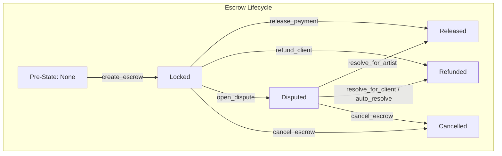

# StellarAid Smart Contract Events Reference

All Soroban smart contracts in the **StellarAid** ecosystem emit structured on-chain events for off-chain indexing, analytics, notifications, and client state synchronization.

Events are emitted using the Soroban host environment method:
```rust
env.events().publish(topics_tuple, payload_tuple);
```

---

## Table of Contents

1. [Architecture & Naming Conventions](#architecture--naming-conventions)
2. [Contract Event Catalogs](#contract-event-catalogs)
   - [1. Escrow Contract](#1-escrow-contract)
   - [2. Commission Agreement Contract](#2-commission-agreement-contract)
   - [3. Dispute Arbiter Contract](#3-dispute-arbiter-contract)
   - [4. Platform Configuration Contract](#4-platform-configuration-contract)
   - [5. Campaign Contract](#5-campaign-contract)
   - [6. Donation Contract](#6-donation-contract)
   - [7. Withdrawal Contract](#7-withdrawal-contract)
   - [8. Revenue Sharing Contract](#8-revenue-sharing-contract)
   - [9. Creator Fund Contract](#9-creator-fund-contract)
   - [10. Competitions Contract](#10-competitions-contract)
   - [11. Subscription Contract](#11-subscription-contract)
   - [12. Verification Contract](#12-verification-contract)
   - [13. Messaging Contract](#13-messaging-contract)
   - [14. Shared / Pause & Lookup Events](#14-shared--pause--lookup-events)
3. [Event Data Structures & Encoding](#event-data-structures--encoding)
4. [Emission Conditions & State Transitions Matrix](#emission-conditions--state-transitions-matrix)
5. [Event Subscription & Indexing Guide](#event-subscription--indexing-guide)
   - [Stellar RPC `getEvents` Filtering](#stellar-rpc-getevents-filtering)
   - [TypeScript Real-Time Ingestion Loop](#typescript-real-time-ingestion-loop)
   - [Re-org Resilience & Idempotency](#re-org-resilience--idempotency)
6. [Ordering Guarantees & Consistency Models](#ordering-guarantees--consistency-models)

---

## Architecture & Naming Conventions

StellarAid enforces a **standardized two-topic tuple hierarchy**:

```
topics: ( Symbol("<contract_domain>"), Symbol("<action_name>") )
```

* **Topic 0 (Domain):** Identifies the smart contract subsystem (e.g., `escrow`, `agr`, `dispute`, `config`, `camp`, `dnt`).
* **Topic 1 (Action):** Identifies the state transition or operation (e.g., `created`, `released`, `refunded`, `opened`, `approved`).
* **Payload:** A typed tuple or single ScVal containing event parameters in deterministic order.

```rust
// Example: Escrow Created Event
env.events().publish(
    (symbol_short!("escrow"), symbol_short!("created")),
    (commission_id, client, artist, amount_stroops, fee_bps),
);
```

---

## Contract Event Catalogs

### 1. Escrow Contract

Emitted by `contracts/escrow` during payment custody lifecycle.

#### `escrow` / `created`
* **Trigger:** `create_escrow`
* **Condition:** Successful lock of client token funds into escrow storage.
* **Payload:**

| Field | Type | Description |
|---|---|---|
| `commission_id` | `Bytes` | Unique commission identifier |
| `client` | `Address` | Client payer address |
| `artist` | `Address` | Artist payee address |
| `amount` | `i128` | Total locked token amount (in stroops) |
| `fee_bps` | `u32` | Platform fee in basis points (e.g. 500 = 5%) |

#### `escrow` / `released`
* **Trigger:** `release_payment`
* **Condition:** Client authorizes full release of funds to artist; net payout and fee transfers succeed.
* **Payload:**

| Field | Type | Description |
|---|---|---|
| `commission_id` | `Bytes` | Unique commission identifier |
| `artist` | `Address` | Artist recipient address |
| `net_amount` | `i128` | Net funds transferred to artist |
| `fee_amount` | `i128` | Platform fee transferred to platform wallet |

#### `escrow` / `refunded`
* **Trigger:** `refund_client`
* **Condition:** Escrow is cancelled, expired, or decided in client's favor via dispute arbitration.
* **Payload:**

| Field | Type | Description |
|---|---|---|
| `commission_id` | `Bytes` | Unique commission identifier |
| `client` | `Address` | Payer receiving refund |
| `amount` | `i128` | Total refunded amount |

#### `escrow` / `disputed`
* **Trigger:** `open_dispute`
* **Condition:** Client, artist, or dispute arbiter flags escrow for investigation.
* **Payload:**

| Field | Type | Description |
|---|---|---|
| `commission_id` | `Bytes` | Unique commission identifier |
| `initiator` | `Address` | Address opening the dispute |

#### `escrow` / `expired`
* **Trigger:** `check_and_expire` or automated sweep
* **Condition:** Ledger sequence exceeds expiration ledger without resolution.
* **Payload:**

| Field | Type | Description |
|---|---|---|
| `commission_id` | `Bytes` | Unique commission identifier |
| `expiry_ledger` | `u32` | Ledger sequence at expiration |

#### `escrow` / `cancelled`
* **Trigger:** `cancel_escrow`
* **Condition:** Agreement cancellation policy executed with pro-rata split.
* **Payload:**

| Field | Type | Description |
|---|---|---|
| `commission_id` | `Bytes` | Unique commission identifier |
| `client_amount` | `i128` | Amount returned to client |
| `artist_amount` | `i128` | Amount paid to artist |

---

### 2. Commission Agreement Contract

Emitted by `contracts/commission_agreement` during agreement negotiations and milestone progress.

#### `agr` / `created`
* **Trigger:** `create_agreement`
* **Payload:** `(commission_id: Bytes, client: Address, artist: Address, budget_usdc: i128, deadline: u32)`

#### `agr_ok` / `(none)` (`symbol_short!("agr_ok")`)
* **Trigger:** `accept_agreement`
* **Payload:** `(commission_id: Bytes)`

#### `agr_rej` / `(none)` (`symbol_short!("agr_rej")`)
* **Trigger:** `reject_agreement`
* **Payload:** `(commission_id: Bytes, reason: String)`

#### `ms_new` / `(none)` (`symbol_short!("ms_new")`)
* **Trigger:** `propose_milestone`
* **Payload:** `(commission_id: Bytes, milestone_id: Bytes, amount_usdc: i128)`

#### `ms_approved` / `(none)` (`Symbol::new("ms_approved")`)
* **Trigger:** `approve_milestone`
* **Payload:** `(commission_id: Bytes, milestone_id: Bytes)`

#### `canc_pol` / `(none)` (`symbol_short!("canc_pol")`)
* **Trigger:** `set_cancellation_policy`
* **Payload:** `(commission_id: Bytes, penalty_bps: u32, grace_ledgers: u32)`

---

### 3. Dispute Arbiter Contract

Emitted by `contracts/dispute_arbiter` during dispute resolution.

#### `dispute` / `opened`
* **Trigger:** `open_dispute`
* **Payload:** `(commission_id: Bytes, initiator: Address, opened_ledger: u32, auto_resolve_ledger: u32)`

#### `dispute` / `resolved`
* **Trigger:** `resolve_for_client`, `resolve_for_artist`, or `partial_resolve`
* **Payload:** `(commission_id: Bytes, status: DisputeStatus, client_share_bps: u32, note: String)`

#### `dispute` / `auto_resolved`
* **Trigger:** `auto_resolve`
* **Payload:** `(commission_id: Bytes, resolved_at_ledger: u32)`

#### `dispute` / `init`
* **Trigger:** `initialize`
* **Payload:** `(admin: Address, escrow: Address, config: Address, auto_resolve_ledgers: u32)`

---

### 4. Platform Configuration Contract

Emitted by `contracts/platform_config`.

#### `config_initialized`
* **Trigger:** `initialize`
* **Payload:** `(admin: Address, fee_bps: u32, platform_wallet: Address, usdc_token: Address)`

#### `fee_bps_updated`
* **Trigger:** `set_fee_bps`
* **Payload:** `(old_fee_bps: u32, new_fee_bps: u32)`

#### `admin_transfer_initiated`
* **Trigger:** `transfer_admin`
* **Payload:** `(current_admin: Address, pending_admin: Address)`

#### `admin_transfer_completed`
* **Trigger:** `accept_admin`
* **Payload:** `(old_admin: Address, new_admin: Address)`

---

### 5. Campaign Contract

Emitted by `contracts/campaign`.

* `campaign_registered`: `(campaign_id: u64, owner: Address, goal: i128, deadline: u64)`
* `campaign_status_changed`: `(campaign_id: u64, old_status: CampaignStatus, new_status: CampaignStatus)`
* `campaign_archived`: `(campaign_id: u64)`

---

### 6. Donation Contract

Emitted by `contracts/donation`.

* `donation_made`: `(donor: Address, campaign_id: u64, amount: i128, timestamp: u64)`
* `refund_recorded`: `(campaign_id: u64, donor: Address, amount: i128, caller: Address)`
* `anonymous_donation`: `(campaign_id: u64, amount: i128)`

---

### 7. Withdrawal Contract

Emitted by `contracts/withdrawal`.

* `withdrawal_requested`: `(withdrawal_id: u64, campaign_id: u64, recipient: Address, amount: i128)`
* `withdrawal_approved`: `(withdrawal_id: u64, tx_hash: BytesN<32>)`
* `withdrawal_rejected`: `(withdrawal_id: u64, reason: String)`

---

### 8. Revenue Sharing Contract

Emitted by `contracts/revenue_sharing`.

* `agreement_created`: `(agreement_id: Bytes, creator: Address, total_bps: u32)`
* `revenue_distributed`: `(agreement_id: Bytes, total_amount: i128, participant_count: u32)`
* `agreement_paused`: `(agreement_id: Bytes)`
* `agreement_terminated`: `(agreement_id: Bytes)`

---

### 9. Creator Fund Contract

Emitted by `contracts/creator_fund`.

* `fund_created`: `(fund_id: Bytes, steward: Address, fund_type: FundType)`
* `proposal_submitted`: `(proposal_id: Bytes, recipient: Address, amount: i128)`
* `proposal_voted`: `(proposal_id: Bytes, voter: Address, support: bool, weight: i128)`
* `proposal_executed`: `(proposal_id: Bytes, amount: i128)`

---

### 10. Competitions Contract

Emitted by `contracts/competitions`.

* `comp_created`: `(competition_id: Bytes, organizer: Address, prize_pool: i128)`
* `submission_made`: `(competition_id: Bytes, participant: Address, uri: String)`
* `comp_finalized`: `(competition_id: Bytes, winner_count: u32)`
* `prizes_distributed`: `(competition_id: Bytes, total_paid: i128)`

---

### 11. Subscription Contract

Emitted by `contracts/subscription`.

* `tier_created`: `(tier_id: u32, price_stroops: i128, period_ledgers: u32)`
* `subscribed`: `(subscriber: Address, tier_id: u32, end_ledger: u32)`
* `renewed`: `(subscriber: Address, tier_id: u32, new_end_ledger: u32)`
* `cancelled`: `(subscriber: Address, tier_id: u32)`
* `lapsed`: `(subscriber: Address, tier_id: u32)`

---

### 12. Verification Contract

Emitted by `contracts/verification`.

* `request_submitted`: `(artist: Address, work_count: u32)`
* `reviewed`: `(artist: Address, reviewer: Address, score: u32)`
* `approved`: `(artist: Address, final_score: u32)`
* `stale_flagged`: `(artist: Address, last_update_ledger: u32)`

---

### 13. Messaging Contract

Emitted by `contracts/messaging`.

* `convo_created`: `(convo_id: Bytes, participant1: Address, participant2: Address)`
* `msg_sent`: `(convo_id: Bytes, sender: Address, timestamp: u64)`
* `msg_read`: `(convo_id: Bytes, reader: Address, last_read_idx: u32)`
* `typing_set`: `(convo_id: Bytes, user: Address, is_typing: bool)`

---

### 14. Shared / Pause & Lookup Events

Emitted by all contracts inheriting `contracts/shared`.

* `contract_paused`: `(admin: Address)`
* `contract_unpaused`: `(admin: Address)`
* `cfg_fail`: `(config_contract: Address, selector: Symbol)`

---

## Emission Conditions & State Transitions Matrix



| Event | Pre-condition | Post-condition | Authorization Required |
|---|---|---|---|
| `(escrow, created)` | Escrow key does not exist; client balance >= amount | Escrow state = `Locked`; tokens transferred to contract | `client.require_auth()` |
| `(escrow, released)` | Escrow state = `Locked` or `Disputed` | Escrow state = `Released`; tokens sent to artist & fee wallet | `client.require_auth()` or `arbiter` |
| `(escrow, refunded)` | Escrow state = `Locked`, `Disputed`, or `Expired` | Escrow state = `Refunded`; tokens returned to client | `client.require_auth()` or `arbiter` |
| `(escrow, disputed)` | Escrow state = `Locked` | Escrow state = `Disputed` | `initiator.require_auth()` |
| `(escrow, cancelled)` | Escrow state = `Locked` or `Disputed`; cancellation policy satisfied | Escrow state = `Cancelled`; pro-rata split distributed | `client.require_auth()` |

---

## Event Subscription & Indexing Guide

### Stellar RPC `getEvents` Filtering

Soroban RPC servers provide a `getEvents` endpoint supporting topic-based filtering and ledger pagination.

```typescript
import { rpc } from '@stellar/stellar-sdk';

const server = new rpc.Server('https://soroban-testnet.stellar.org');

// Example: Filter for all escrow events
const eventsResponse = await server.getEvents({
  startLedger: 100000,
  filters: [
    {
      type: 'contract',
      contractIds: ['CAAAAAAAAAAAAAAAAAAAAAAAAAAAAAAAAAAAAAAAAAAAAAAAAAAAMDR4'],
      topics: [
        // Match topic 0 = "escrow", topic 1 = any
        ['escrow', '*']
      ],
    }
  ],
  limit: 100,
});
```

### TypeScript Real-Time Ingestion Loop

```typescript
import { rpc, scValToNative } from '@stellar/stellar-sdk';

export async function startIndexer(
  rpcUrl: string,
  contractId: string,
  onEvent: (event: any) => Promise<void>
) {
  const server = new rpc.Server(rpcUrl);
  let cursor: string | undefined = undefined;

  console.log(`[Indexer] Starting event ingestion for ${contractId}...`);

  while (true) {
    try {
      const response = await server.getEvents({
        cursor,
        filters: [{ type: 'contract', contractIds: [contractId] }],
        limit: 50,
      });

      for (const rawEvent of response.events) {
        const topics = rawEvent.topic.map(t => scValToNative(t));
        const value = scValToNative(rawEvent.value);

        await onEvent({
          id: rawEvent.id,
          ledger: rawEvent.ledger,
          ledgerClosedAt: rawEvent.ledgerClosedAt,
          topics,
          payload: value,
        });

        cursor = rawEvent.pagingToken;
      }
    } catch (err) {
      console.error('[Indexer] RPC Error in event polling, backing off...', err);
      await new Promise(r => setTimeout(r, 5000));
    }

    await new Promise(r => setTimeout(r, 2000));
  }
}
```

### Re-org Resilience & Idempotency

1. **Unique Event Primary Key:** Always use `${event.ledger}_${event.txHash}_${event.eventIndex}` as the deduplication key in relational databases.
2. **Transaction Atomicity:** Ingest events within database transactions corresponding to ledger sequence blocks.
3. **Rollback Handling:** If the RPC reports a ledger re-organization, purge unfinalized events for ledger >= `reorg_start_ledger` before replaying.

---

## Ordering Guarantees & Consistency Models

Stellar Soroban guarantees **total causal event ordering**:

1. **Ledger Sequence Number:** Ledgers close deterministically strictly sequentially ($L_1 < L_2 < L_3$).
2. **Transaction Execution Order:** Within ledger $L_n$, transactions are applied strictly sequentially according to their transaction envelope order.
3. **Intra-Transaction Emission Order:** Within a single transaction execution (including cross-contract calls), events are appended in exact chronological order of `env.events().publish()` invocations.
4. **Finality:** Stellar Consensus Protocol (SCP) achieves instant deterministic finality at ledger close (no probabilistic forks like PoW/Nakamoto consensus).
