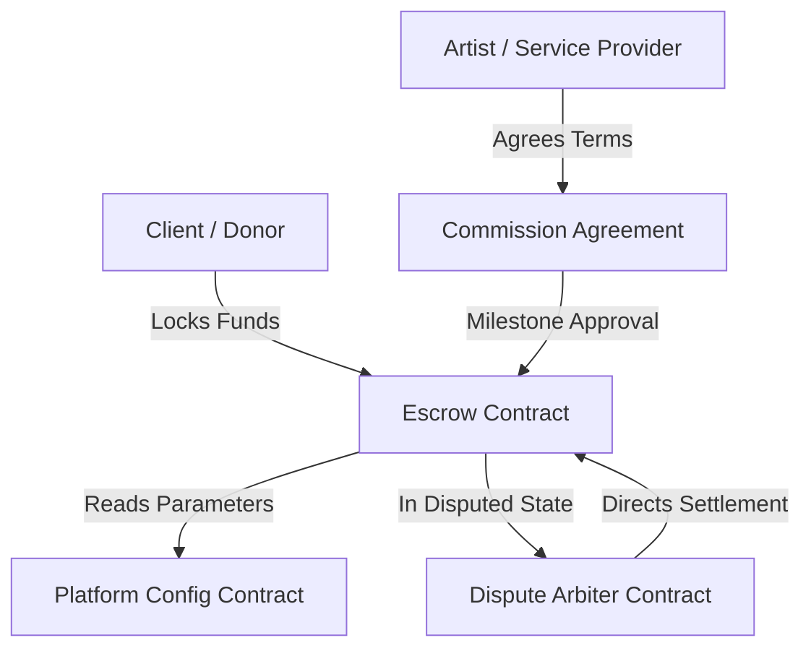

# StellarAid Smart Contract Video Walkthroughs

Welcome to the official video walkthrough repository and technical companion guide for the **StellarAid Soroban Smart Contracts**.

These walkthroughs provide in-depth code reviews, architecture diagrams, runtime execution traces, gas & CPU performance profiling, and security considerations across the contract suite.

---

## Video Index & Curated Library

| Episode | Title | Target Contract | Duration | Focus Area | Companion Guide |
|---------|-------|-----------------|----------|------------|-----------------|
| **01** | **Escrow Contract & CEI Pattern** | `contracts/escrow` | 18:45 | Locking, Payouts, Refunds, Mutex Guards | [View Guide](escrow-contract-walkthrough.md) |
| **02** | **Commission Lifecycle & Milestones** | `contracts/commission_agreement` | 21:30 | Multi-Milestone State Machine, Agency Roster, Pro-rata Payouts | [View Guide](commission-flow-walkthrough.md) |
| **03** | **Dispute Resolution & Auto-Arbitration** | `contracts/dispute_arbiter` | 16:15 | Cross-Contract Calls, Timelock Fallback, Split Calculations | [View Guide](dispute-resolution-walkthrough.md) |

---

## Video Series Architecture Overview

---

## Accompanying Learning Objectives

Each walkthrough is designed to provide:

1. **Step-by-Step Code Annotations:** Line-by-line inspection of Soroban SDK macros, storage key structures, and error handling.
2. **Execution Traces:** Sequence diagrams mapping transaction invocations from client wallets through Stellar Soroban host environment.
3. **Gas & Resource Performance Notes:** Instruction counts, memory limits, storage read/write footprints, and ledger rent optimizations.
4. **Security Best Practices:** Authorization checks (`require_auth()`), re-entrancy prevention, integer overflow protection, and boundary validation.

---

## Accessing Video Recordings & Transcripts

* **YouTube Playlist:** `https://youtube.com/playlist?list=stellar-aid-contract-walkthroughs`
* **IPFS Mirror:** `ipfs://QmStellarAidContractWalkthroughVideos2026`
* **Local Transcripts & Slides:** Available directly within each markdown guide in this directory.
