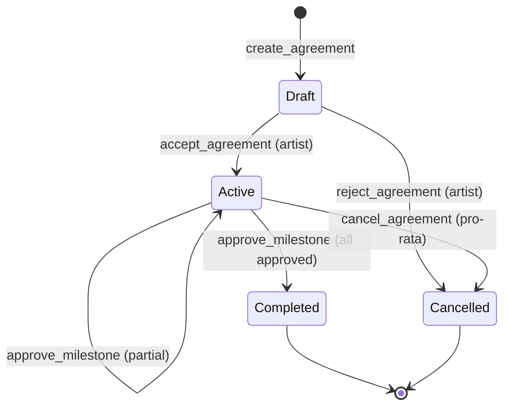

# Video Walkthrough: Commission Agreement & Milestone Flow

* **Video Title:** *Multi-Milestone Commission Contracts, Agency Delegations, and Atomic Settlements*
* **Video Duration:** 21 minutes 30 seconds
* **Contract Under Review:** [`contracts/commission_agreement/src/lib.rs`](../../contracts/commission_agreement/src/lib.rs)
* **Recording Link:** [Watch on StellarAid DevPortal](https://dev.stellaraid.org/videos/02-commission-agreement) | [IPFS Mirror](ipfs://QmCommissionWalkthroughVideo2026)

---

## Video Chapter Timestamps

```
00:00 - Introduction to Multi-Milestone Agreements
03:10 - Agreement Lifecycle: create_agreement, accept, & reject
07:45 - Milestone Proposal & Budget Invariant Verification
11:20 - Milestone Approval & Automatic Agreement Completion
14:35 - Agency Roster & Delegated Payment Splits
17:50 - Pro-Rata Cancellation Settlement & Penalty Logic
20:10 - Gas & Vector Serialization Performance Notes
```

---

## Agreement State Machine



---

## Detailed Code Annotations

### 1. Enforcing Budget Invariants on Milestone Proposals

```rust
// Ensure milestone amount does not exceed total budget
let current_allocated: i128 = milestones.iter().map(|m| m.amount_usdc).sum();
if current_allocated.checked_add(amount_usdc).unwrap_or(i128::MAX) > record.budget_usdc {
    return Err(AgreementError::MilestoneBudgetExceeded);
}
```

### 2. Concurrency Control with Milestone Serialization Locks

```rust
let lock_key = DataKey::MilestoneLock(commission_id.clone(), milestone_id.clone());
if env.storage().persistent().has(&lock_key) {
    return Err(AgreementError::MilestoneLocked);
}
env.storage().persistent().set(&lock_key, &true);

// ... perform status update and all_approved check ...

env.storage().persistent().remove(&lock_key);
```

---

## Performance & Optimization Notes

* **Milestone Pagination / Vector Storage:** Per-agreement milestones are indexed under `DataKey::MilestonesForAgreement(Bytes)`. For agreements with <= 20 milestones, serializing the full vector into persistent storage executes well within the 100K instruction CPU threshold.
* **String Allocation Limits:** Title and rejection reason strings are strictly bounded to 256 bytes to prevent storage spam and excessive gas consumption (`AgreementError::InputTooLong`).
