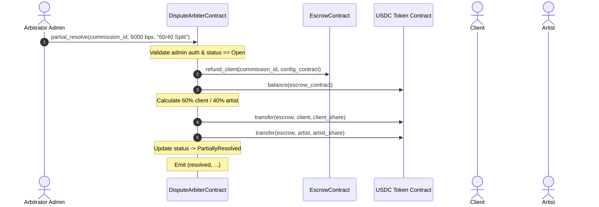

# Video Walkthrough: Dispute Arbiter & Cross-Contract Resolution

* **Video Title:** *Autonomous Dispute Arbitration, Basis-Point Splitting, and Fallback Timelocks*
* **Video Duration:** 16 minutes 15 seconds
* **Contract Under Review:** [`contracts/dispute_arbiter/src/lib.rs`](../../contracts/dispute_arbiter/src/lib.rs)
* **Recording Link:** [Watch on StellarAid DevPortal](https://dev.stellaraid.org/videos/03-dispute-arbiter) | [IPFS Mirror](ipfs://QmDisputeArbiterWalkthroughVideo2026)

---

## Video Chapter Timestamps

```
00:00 - Dispute Resolution Architecture Overview
02:30 - Opening Disputes from Client or Artist
05:15 - Full Client Win vs Full Artist Win Settlements
08:00 - Partial Resolution & Basis-Point Percentage Calculations
11:40 - The Auto-Resolution Timelock Fallback Mechanism
14:10 - Cross-Contract Authorization & Error Propagation
15:45 - Security & Gas Benchmarks
```

---

## Sequence: Partial Dispute Resolution



---

## Key Technical Details

### 1. Auto-Resolution Fallback
If the designated arbitrator does not act within `auto_resolve_ledgers` (e.g., ~100 ledgers in test, ~864,000 in production):
```rust
if current_ledger < record.opened_ledger.saturating_add(auto_resolve_ledgers) {
    return Err(DisputeError::AutoResolveNotDue);
}
// Automatically refunds the client to prevent indefinite lockup
escrow_refund_client(&env, &escrow_contract, commission_id, config_contract);
```

### 2. Arithmetic Safety in Basis Point Math
```rust
let client_share = escrow_balance * (client_share_bps as i128) / 10000;
let artist_share = escrow_balance * (artist_share_bps as i128) / 10000;
```
Enforces `client_share_bps + artist_share_bps == 10000` with overflow-checked operations.
