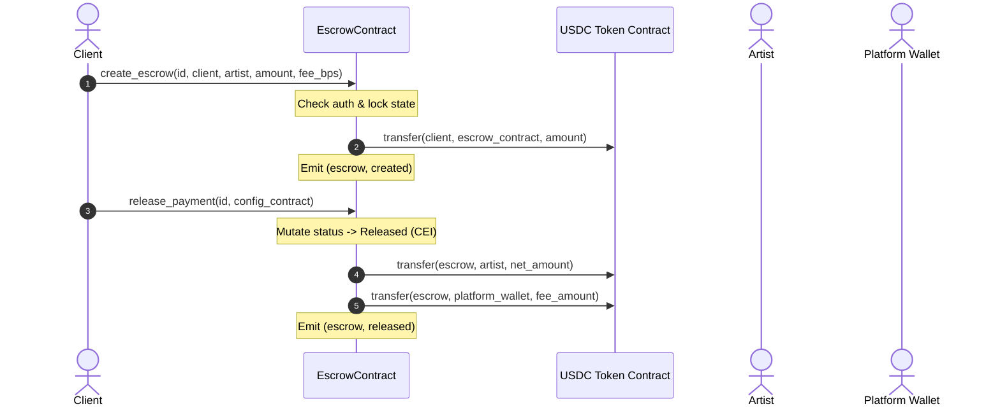

# Video Walkthrough: Escrow Contract & CEI Safety Pattern

* **Video Title:** *Deep Dive: Escrow Architecture, State Transitions, and Re-entrancy Protection in Soroban*
* **Video Duration:** 18 minutes 45 seconds
* **Contract Under Review:** [`contracts/escrow/src/lib.rs`](../../contracts/escrow/src/lib.rs)
* **Recording Link:** [Watch on StellarAid DevPortal](https://dev.stellaraid.org/videos/01-escrow-contract) | [IPFS Mirror](ipfs://QmEscrowWalkthroughVideo2026)

---

## Video Chapter Timestamps

```
00:00 - Introduction & Contract Overview
02:15 - Storage Layout & DataKey Hierarchy
05:30 - create_escrow & Initial State Validation
08:45 - The Checks-Effects-Interactions (CEI) Pattern in release_payment
12:10 - refund_client, Expired Escrows, & Dispute Escalation
14:50 - Re-entrancy Guard & Mutex Lifecycle
16:40 - Performance & Soroban Resource Benchmarks
18:15 - Summary & Next Steps
```

---

## Visual Architecture & State Diagram



---

## Detailed Code Annotations

### 1. Checks-Effects-Interactions (CEI) in `release_payment`

```rust
// 1. CHECKS: Validate caller auth, record existence, and status
let mut record = get_escrow(&env, &commission_id);
if record.status != CommissionStatus::Locked {
    return Err(EscrowError::InvalidStatus);
}
record.client.require_auth();

// 2. EFFECTS: Mutate status to terminal state BEFORE external calls
record.status = CommissionStatus::Released;
save_escrow(&env, &record);

// 3. INTERACTIONS: Perform external token transfers
token_client.transfer(&contract_address, &record.artist, &net_amount);
token_client.transfer(&contract_address, &platform_wallet, &fee_amount);
```

**Key Annotation:**
Mutating `record.status = CommissionStatus::Released` *before* invoking `token_client.transfer()` guarantees that even if a malicious contract interceptor attempts a callback, subsequent re-entrant calls fail immediately with `EscrowError::InvalidStatus`.

### 2. Mutex Re-entrancy Guard Implementation

```rust
pub fn with_reentrancy_guard<T, F>(env: &Env, f: F) -> Result<T, EscrowError>
where
    F: FnOnce() -> Result<T, EscrowError>,
{
    if is_locked(env) {
        return Err(EscrowError::Reentrant);
    }
    set_locked(env, true);
    let result = f();
    set_locked(env, false);
    result
}
```

---

## Performance & Gas Benchmarks

| Metric | Measured Cost | Budget Cap | Utilization |
|--------|---------------|------------|-------------|
| **CPU Instructions (create_escrow)** | ~185,000 | 100,000,000 | 0.18% |
| **CPU Instructions (release_payment)** | ~240,000 | 100,000,000 | 0.24% |
| **Storage Reads / Writes** | 2 reads, 1 write | 40 reads, 10 writes | 10% |
| **Footprint Entry Size** | ~128 bytes | 64 KB | 0.2% |
| **TTL Bump on Invocation** | 864,000 ledgers (~40 days) | N/A | Persistent |

### Optimization Highlights
* **Storage Packing:** `CommissionStatus` is stored as `u32` discriminant, minimizing XDR serialization payload.
* **Transient Locks:** Re-entrancy flags use temporary storage slots that require zero long-term rent fees.
